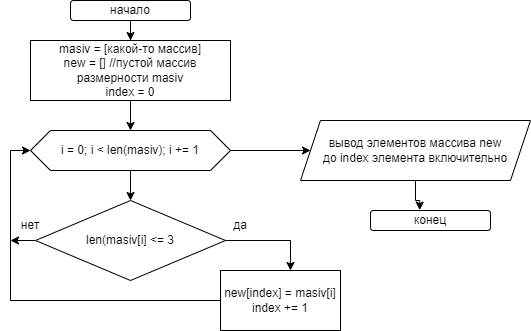

## Выполнение контрольного задания

# Задача: Написать программу, которая из имеющегося массива строк формирует массив строк, длина которых меньше или равна 3 (три) символа. При решении не рекомендуется пользоваться коллекциями, лучше обойтись исключительно массивами.

# Алгоритм представлен ниже на рисунке:
